# Stele

An agent with one total PnL number cannot tell you which of its ideas lost the money, so it keeps
running the broken one all week. Stele ties every WEEX futures order to a named written thesis, keeps
a realized PnL ledger per thesis, and cuts the capital of any thesis that is under water until the
agent refuses its own order.

The stakes are real money over five consecutive weekly live rounds, and the ranking weighs return
performance, risk control and strategy stability together. WEEX put their own Season 1 headline at
**80% win rate to 40% drawdown**: good hit rates, and still deep in the hole at the end of the round.

> Live console: `<ADD_LIVE_URL>`
>
> Video: `<ADD_VIDEO_URL>`

**If you read nothing else, go to [DEMO.md](DEMO.md) step 4.** That is the agent refusing an order it
wanted to place, and WEEX issuing a receipt for the refusal.

## Try it in 60 seconds

1. Open `<ADD_LIVE_URL>/console`. **No wallet, no account, no API keys required.** Every panel is
   populated on seeded data with zero environment variables set.
2. Press **Run decision loop** on `SIG-9104`, the SOL squeeze signal.
3. Its thesis `TH-SQZ-LONG` reads **-2.14% over 7 closed trades**, past the -2.0% halt line. The
   valve multiplier goes to `0.00x`, a red **REFUSED** row appears, `0.00 USDT deployed` is printed,
   and the refusal is posted to `/capi/v3/order/uploadAiLog` as a `stage: "rejection"` record.

That is the whole product in one click. [DEMO.md](DEMO.md) walks all six steps in order.

## The problem

The cause of the Season 1 headline is almost always the same. The agent has a total PnL and nothing
else, so it has no way to know which reason lost the money, and it reproduces that reason until the
round ends. Ask a solo agent operator on Friday night which of their ideas killed them and they
cannot answer.

## The solution

Stele refuses to let an order exist without a reason attached to it.

1. Before the round starts, six theses are written down: each with a name and an entry condition.
   Example: *funding under -0.02% for three settlements while open interest adds more than 4% in an
   hour, take the squeeze long.*
2. When a signal arrives, it is matched to one of those written theses. A signal matching none of
   them never becomes an order.
3. The order goes out over WEEX OpenAPI v3. The same decision is posted to
   `/capi/v3/order/uploadAiLog` with `stage`, `model`, `input`, `output` and a 1000 character
   `explanation`. The returned `orderId` pairs the fill with the thesis.
4. When the position closes, its realized PnL is written back to that thesis. The **Close at stop**
   control on each open position row does it for one position through `POST /api/attribute`, and the
   attribution job in `lib/store/weex-store.ts` does it in bulk from WEEX closed fills. Both end in
   the same `applyFillToThesis()` call in `lib/attribution.ts`, so the two paths cannot drift.
5. The size of the next order comes from that thesis's own ledger, not from the agent's overall
   performance. A thesis at or past the halt line drops to zero capital and the agent refuses its own
   order. The refusal is posted to the same log endpoint.

The first wow moment is step 5 running live, which is DEMO.md step 4. The second is step 4 running on
screen, which is DEMO.md step 6: press **Close at stop** on the `TH-VOL-CRUSH` position, the realized
-4.50 USDT lands on that thesis, its ledger crosses the halt line, its badge turns red with no page
reload, and the signal waiting behind it goes from half size to refused. The agent's memory is edited
live by a closed loss, and the valve reacts to it in the same second.

## Architecture

```mermaid
flowchart TD
  A["app/console/page.tsx"] --> B["components/DecisionConsole.tsx"]
  B --> C["components/ThesisLedger.tsx"]
  B --> D["components/DecisionLog.tsx"]
  B -->|"POST { signalId }"| E["app/api/decide/route.ts"]
  E -->|"valveFor, sizeOrder, bracketFor"| F["lib/valve.ts"]
  E -->|"judge"| G["lib/agent.ts"]
  G -->|"messages.create"| H["Anthropic API"]
  E -->|"placeOrder sim, then live"| I["lib/weex.ts"]
  E -->|"uploadAiLog, every decision including refusals"| I
  I -->|"HMAC SHA256 signed"| J["WEEX OpenAPI v3 (api-contract.weex.com)"]
  E -->|"one round snapshot"| K["lib/store/round.ts"]
  K --> L["lib/data/seed.json"]
  K --> A
  M["app/evidence/page.tsx"] --> N["lib/evidence.ts"]
  N --> I
  K --> M
```



Every node is a file in this repo or a service the repo calls. `lib/valve.ts` is pure arithmetic with
no I/O, which is the point: the model picks the thesis and writes the explanation, and the valve
alone decides the size.

## How it uses the required tech

**WEEX OpenAPI v3** (`lib/weex.ts`). One module, both paths in the same functions. With
`WEEX_API_KEY`, `WEEX_API_SECRET` and `WEEX_API_PASSPHRASE` set, every call is HMAC SHA256 signed
(`ACCESS-KEY` / `ACCESS-SIGN` / `ACCESS-TIMESTAMP` / `ACCESS-PASSPHRASE`) and sent to
`api-contract.weex.com`. Without them the same functions return shaped mock envelopes so the console
is inspectable before the API allowlist clears. Covered: `placeOrder` with preset take profit and
stop loss, `uploadAiLog`, and `market/ticker`. `WEEX_VENUE=sim` rewrites `/capi/v3/` to
`/capi/v3/sim/` inside `pathFor()`, which is how the shadow run works: every decision fills on sim
first, then live, and the console shows both prices side by side.

**uploadAiLog as the ledger, not as paperwork.** WEEX disqualifies teams that cannot produce valid
evidence of AI participation, and only allowlisted UIDs may post. Stele writes `stage`, `model`,
`input`, `output` and the explanation on every decision including rejections, truncated to the 1000
character limit inside `uploadAiLog()` rather than at the call site. The record is written to the
round before the POST is attempted, so a rejected write is a queued record rather than a lost one.
`POST /api/queue` replays the unsent records oldest first and stops at the first refusal, because a
trail out of order is not evidence. The queue depth is visible in the console header and the whole
trail is on `/evidence`.

**Anthropic model chain** (`lib/agent.ts`). Three links tried in order, all returning the same shape:
the Anthropic SDK with structured tool output when `ANTHROPIC_API_KEY` is set, then the developer's
local `claude` CLI, then a deterministic offline stub. The model does exactly two jobs: confirm the
signal satisfies the written precondition, and write the explanation that goes to WEEX. It never
sizes the order.

## Tech stack

- Next.js 15 (App Router), TypeScript strict, Tailwind CSS v4
- WEEX OpenAPI v3 over `fetch` with `node:crypto` HMAC SHA256 signing, no third party client
- `@anthropic-ai/sdk` with tool-based structured output, validated with `zod` before it is trusted
- Route handler on the Node runtime for the decision loop, deploys to Vercel with no custom server
- `node:test` for the pure modules: the valve, attribution and the edge schemas

## Quickstart

```bash
npm install
cp .env.example .env.local   # every variable is optional
npm run dev                  # http://localhost:3000/console
npm run build                # production build, the deploy gate
npm test                     # node:test over the valve, attribution and the edge schemas
```

Two more scripts exist and both do a real job:

- `npm run seed` validates the invariants in `lib/data/seed.json` and writes
  `public/seed-manifest.json`. It is deterministic and it does **not** touch the round store, which
  seeds itself lazily from `lib/store/fresh.ts` on the first read. There is no migration command and
  no SQL in this build.
- `npm run demo:reset` posts to `/api/reset` and puts the running app back to the opening frame of
  DEMO.md. The **Reset round** control in the console header does the same thing. Run one of them
  before every take: the round is server state on purpose, so without a reset the second take opens
  on the first take's leftovers.

`npm test` needs **Node 22.18 or newer**, which strips TypeScript types natively. There is no test
build step and no test framework in `devDependencies`.

## Deployed artifacts

| Artifact | Where | Notes |
| --- | --- | --- |
| Live console | `<ADD_LIVE_URL>` | Vercel. Start at `/console`, DEMO.md step 4 is the wow step. |
| Demo video | `<ADD_VIDEO_URL>` | 90 second single take. Shot list in [docs/VIDEO.md](docs/VIDEO.md). |
| WEEX venue | `/capi/v3/sim` demo futures | Flipped by `WEEX_VENUE`. `pathFor()` in `lib/weex.ts` is the whole switch. |

There is no chain, no contract and no explorer in this project. It is an exchange API client, so
there is nothing to deploy on-chain and nothing to link to a block explorer.

## Competition tracks

| Track | Prize (as recorded) | Load-bearing file | DEMO.md step |
| --- | --- | --- | --- |
| `AI Team` | `200,000 USDT ana ödül havuzunun paylaşımı` (a share of the 200,000 USDT main prize pool) | `lib/weex.ts` | 2, 4 |
| `AI model token ödülü` | `100 milyon AI model token` (100 million AI model tokens) | `lib/agent.ts`, `lib/weex.ts` uploadAiLog | 2, 5 |
| `Early bird pool` | `52,000 USDT` | account and allowlist setup, not code | before step 1 |
| `New user pool` | `20,000 USDT` | account and allowlist setup, not code | before step 1 |

The DoraHacks prize page could not be fetched during research: every prize URL returned HTTP 405, and
the content was only ever read through an `r.jina.ai` mirror. So the amounts above are **as
announced and not independently verified**, and the within-side distribution is not published
anywhere we could read. Treat them as claims to confirm on the official page, not as figures.

[DELIVERY.md](DELIVERY.md) carries the entry mode, the manual action and the deadline for each of the
four rows, including the one that is a separate Google Form rather than anything this repo can do.

**The depth test, one line per code row.** Remove `lib/weex.ts` and DEMO steps 2, 4 and 5 all break:
step 2 loses `placeOrder()`, step 4 loses `uploadAiLog()` so the refusal has nowhere to be posted,
and step 5 loses `pathFor()`, `hasCredentials()` and `venueFromEnv()`, which `lib/evidence.ts`
imports, so `/evidence` stops compiling. Remove `lib/agent.ts` and the explanation field has no
author: `app/api/decide/route.ts` calls `judge()` for both the thesis match and the 1000 character
explanation, and nothing else in the repo writes one.

## Screenshots

One per numbered step in [DEMO.md](DEMO.md), plus the console at phone width.

| File | Step |
| --- | --- |
| `docs/step-1.png` | 1. Cold open, one screen |
| `docs/step-2.png` | 2. Signal matched, uploadAiLog body fills |
| `docs/step-3.png` | 3. Shadow fill and live fill side by side |
| `docs/step-4.png` | 4. The refusal. First wow step |
| `docs/step-5.png` | 5. The receipt, the evidence trail, a hard refresh |
| `docs/step-6.png` | 6. Close a position, the valve reacts. Second wow step |
| `docs/step-phone.png` | `/console` at 360px width |

These files are **not in the repo yet.** They are captured by hand from the live URL before
submitting, and the order to capture them in is item 2 of the manual checklist at the end of
[HANDOFF.md](HANDOFF.md).

## Store setup

The round is server state. Every decision, the quota it spends, the position it opens and the
uploadAiLog record it writes go into one JSON snapshot that `lib/store/round.ts` owns, which is why
the refusal in step 4 of DEMO.md is still on screen after the hard refresh in step 5.

Two environment variables, **both optional**:

```
KV_REST_API_URL=
KV_REST_API_TOKEN=
```

Any Upstash compatible Redis REST endpoint works, over plain `fetch` with no client library. On
Vercel, add the Upstash integration and it fills both in. Without them the same snapshot lives in a
module scope singleton instead: every step of DEMO.md still works and a decision still survives a
page reload, and only a restart or a cold serverless instance sends the round back to its opening
values. `lib/store/round.ts` is the only file in the repo that touches either driver.

**`ADAPTER_MODE` picks where the ledger comes from.** `fake`, the default, reads the seed ledger in
`lib/data/seed.json`. `real` reads closed positions from WEEX and attributes them: each fill carries
the `client_oid` its order went out with, shaped `stele-<thesisId>-<signalId>-<timestamp>`, so the
realized PnL lands on the thesis that opened the trade. `lib/store/index.ts` is the only module that
reads the variable, and it falls back to the seed when the value is anything but `real` or when the
WEEX credentials are missing, so a typo in a dashboard variable degrades to seeded data instead of a
500. The deployed demo and the recording run on `fake`.

## AI use

Two separate things, and conflating them would be the dishonest version.

**Process.** We used AI coding assistants for scaffolding and boilerplate. Architecture, product
decisions and final code review are our own.

**Product.** The shipped agent calls a Claude model at decision time through `lib/agent.ts`
(`ANTHROPIC_MODEL`, default `claude-opus-5`). The model matches a signal to a written thesis and
authors the explanation posted to WEEX. It never sizes the order: that is `lib/valve.ts`, which is
pure arithmetic. Two deterministic fallbacks sit under the API call so the demo is reproducible
offline, and a judge should know which one is running: `viaClaudeCli()` spawns the developer's local
`claude` CLI, `viaMock()` is the offline stub, and the `if (!hasCredentials())` branch in
`lib/weex.ts` returns shaped mock fills. The console header names the path in use, reading
**Anthropic API** or **offline stub**. The recorded demo runs with `ANTHROPIC_API_KEY` set, because
the model token allocation is awarded on proof of real model usage.

Two rules from WEEX govern this, and both are quoted rather than paraphrased.

- WEEX rule page, https://www.weex.com/api-doc/ai/introduction/Rule: prohibited are high frequency or
  latency arbitrage profit taking, wash trading, market manipulation, data tampering, fabricating AI
  logs, sharing API keys or accounts, and fully manual trading without real AI technology. The
  strategy must be fully or semi automated and all trading must go through the official WEEX
  OpenAPI.
- uploadAiLog doc, https://www.weex.com/api-doc/ai/UploadAiLog: a team that cannot present valid
  evidence of AI participation is removed from the ranking and disqualified.

`/evidence` exists because of the second one. It is the full receipt trail with the endpoint, the
venue, the accepted against queued split, the stage breakdown, the models that answered, and every
record in full against the 1000 character cap.

## What we would build next

- A persisted ledger. `lib/data/seed.json` behind one round blob is still the whole persistence
  layer, so there is no closed trade table and no record of a round that has ended.
- The real attribution job on a timer. `lib/store/weex-store.ts` reads closed fills from
  `/capi/v3/position/history`, and those field names are still unverified against the live WEEX doc.
- A persisted uploadAiLog queue with a retry timer. `POST /api/queue` replays on demand today and
  nothing calls it on a schedule.
- Round rollover: carry the thesis ledger across the five weekly rounds and nothing else, then chart
  per-thesis equity curves so drift is visible before it becomes drawdown.
- Refresh without a click. A fill that closes at the exchange while nobody is looking only shows on
  the next navigation. That wants polling or SSE against `GET /api/round`.
- A compare and set on the round write, for the day two agent processes write the same round.

## License

MIT. See [LICENSE](LICENSE).
